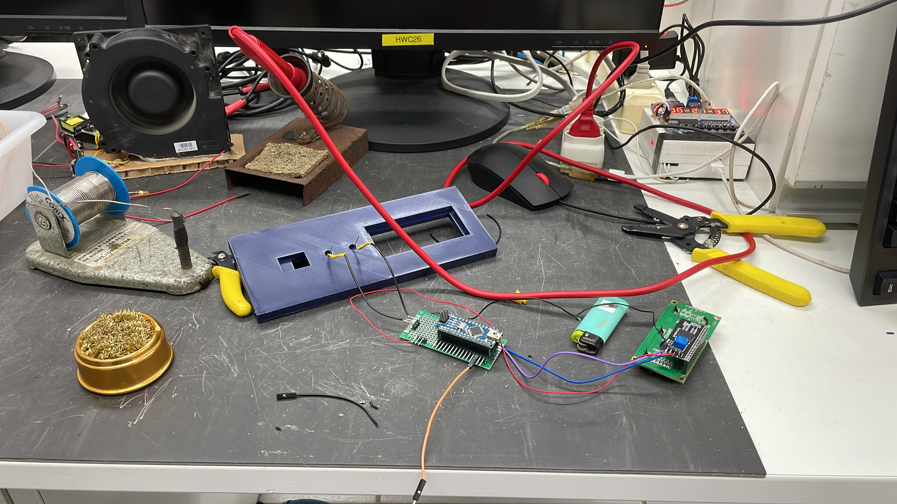

# FlowCycle Pump

**Automated 30-Minute Cyclic Pump Controller Using Arduino UNO**


## Project Overview

The **FlowCycle Pump** is an Arduino-based controller designed to automate precise cyclic timing intervals for laboratory pump operations. It was developed as part of a scientific study at the Center for Health Sciences (CCS) at the Federal University of Pernambuco (UFPE), Brazil.

### Technical vision
This project implements a 30-minute cyclic timer that switches a pump on and off at predefined intervals, providing visual feedback on an LCD and LEDs. The cycle only starts — or restarts — when the user presses the button, allowing flexible pausing during and between runs.

### Scientific Context

| Item | Detail |
| ---- | ------ |
| **Research title (pt-br)**  | **“Avaliação da capacidade oncoprotetora do CR35 em um modelo experimental in vivo de câncer de pulmão associado ao tabagismo”** |
| **Research title (en)**     | **“Oncoprotective capacity of CR35 in an _in‑vivo_ cigarette‑smoke‑associated lung‑cancer model”** |
| **Scientific goal**         | Evaluate whether the thiazolidine‑2,4‑dione derivative **CR35** can prevent lung‑tumor formation in mice exposed to cigarette smoke and urethane, and investigate whether this protection involves modulation of the inflammasome pathway. |
| **Circuit need**            | Automation the repetitive manual dosing procedures required by researchers, improving experimental consistency and freeing researchers from manual intervention.|

## Interactive Circuit Diagram

<p align="center">
  
</p>

Explore and simulate the circuit directly on Tinkercad: 
- [Tinkercad FlowCycle Pump Project](https://www.tinkercad.com/things/bgQsxN3eTv7-flowcycle-pump)

## Table of Contents

- [Project Overview](#project-overview)
  - [Technical Vision](#technical-vision)
  - [Scientific Context](#scientific-context)
- [Interactive Circuit Diagram](#interactive-circuit-diagram)
- [Features](#features)
- [Repository Structure](#repository-structure)
- [Getting Started](#getting-started)
  - [Hardware Assembly](#hardware-assembly)
  - [Uploading the Firmware](#uploading-the-firmware)
  - [Operating Instructions](#operating-instructions)
- [Bill of Materials](#bill-of-materials)
- [Project Roadmap](#project-roadmap)
- [References and Inspiration](#references-and-inspiration)
- [License](#license)

## Features

- **Automated Timing:** Precise pump cycling intervals (default: 2 seconds ON / 30 seconds OFF for 30 minutes).
- **Flexible Pausing:** Pause cycle during and between runs, which also will inform at what time did you pause it.
- **One-button Operation:** Simple user interface for starting and restarting cycles.
- **LCD Feedback:** Real-time status updates and countdown timers (MM:SS format).
- **LED Indicators:** Visual status indication (Green LED: Pump ON, Red LED: Pump OFF, Yellow LED: End of 30 minutes cycle and Pause state).
- **Isolated Power Supply:** Dedicated 6×AA battery pack for the pump ensures reliable operation without interference.

## Repository Structure

```
flowcycle-pump/
├── README.md
├── src/
│   └── FlowCyclePump.ino
│   └── display-liquid-crystal-for-4-pins/main.ino
├── images/
│   └── Circuit prototype layout images 
├── docs/
│   └── Schematic_View.pdf
└── Component_List.csv
```

## Getting Started

### Hardware Assembly

Follow the detailed schematic and layout provided in:

- **Schematic PDF:** [docs/Schematic_View.pdf](https://github.com/Shellyda/flowcycle-pump/blob/f4197e52466bc491275a64fc59c0bba13ee9d35c/docs)
- **Breadboard Layout:** [images/circuit-off.png](https://github.com/Shellyda/flowcycle-pump/blob/f4197e52466bc491275a64fc59c0bba13ee9d35c/images/circuit-off.png)

### Uploading the Firmware

1. Clone this repository:

```bash
git clone https://github.com/Shellyda/flowcycle-pump.git
```

2. Open [FlowCyclePump.ino](https://github.com/Shellyda/flowcycle-pump/blob/f4197e52466bc491275a64fc59c0bba13ee9d35c/src) or [display-liquid-crystal-for-4-pins/main.ino](https://github.com/Shellyda/flowcycle-pump/blob/main/src/display-liquid-crystal-for-4-pins/main.ino) from the `src` folder in Arduino IDE.
3. Upload the sketch to your Arduino UNO.

### Operating Instructions

- Press the push-button once to initiate the automatic cycle (default: 2 seconds ON / 30 seconds OFF for 30 minutes).
- After the cycle ends (30 minutes), the system waits 1 minute and then prompts the user to restart by pressing the button again.

## Bill of Materials

See the included file [Component_List.csv](https://github.com/Shellyda/flowcycle-pump/blob/f4197e52466bc491275a64fc59c0bba13ee9d35c/Component_List.csv) for detailed part specifications and sourcing.

| Qty | Component                            | Description                 |
|-----|--------------------------------------|-----------------------------|
| 1   | Arduino UNO R3                       | Microcontroller board       |
| 1   | nMOS Transistor (MOSFET)             | Low-side pump control       |
| 1   | DC Motor                             | Simulate pump in circuit    |
| 1   | LCD 16×2 (Parallel)                  | Display status messages     |
| 3   | LED indicators (green/red/yellow)    | State visualization         |
| 1   | Momentary push-button                | User interaction            |
| 1   | 4 batteries, AA, no 1.5V Battery     | Independent pump power      |
| 4   | 220 Ω Resistor                       | General assembly part       |
| 1   | 250 kΩ Potentiometer                 | General assembly part       |
| 1   | 10 kΩ Resistor                       | General assembly part       |

## Project Roadmap
### Phase 01 - First prototype of everything on the breadboard and 3D printed box model
<p float="left">
  
  
</p>

### Phase 02 - More tests with the circuit and starting system boarding process
<p float="left">
  
  
</p>

### Phase 03 - Final embedded system
<p float="left">
  
  
</p>

**Prototype completed on 07/31/2025 🥳**

**Planned and Done:**
- Physical assembly and validation of the prototype.
- Extensive testing within experimental protocols.
- Evaluation and reporting of system reliability and accuracy.

## References and Inspiration

- [Arduino-Based Timer for Aquaponics Pump](https://www.instructables.com/Arduino-Based-Timer-for-Aquaponics-Pump/)
- [Pomodoro-Style Study Clock - Science Buddies](https://www.sciencebuddies.org/science-fair-projects/project-ideas/Elec_p099/electricity-electronics/pomodoro-study-clock?ytid=xf4Bnm8edAg&ytsrc=description)
- Video demonstrations:
    - [Video 1](https://youtu.be/_ioq39_vOBU?si=2O4Xa6TVV56mM3De)
    - [Video 2](https://youtu.be/To3DKP99-1U?si=MDcQplFYucp0QRMs)
    - [Video 3](https://youtu.be/XrJ_zLWFGFw?si=tFG6foOzemvXDcbl)

## License

This project is licensed under the MIT License. See `LICENSE` for more information.

---

> FlowCycle Pump is open-source hardware developed to enhance scientific research. You are welcome to fork this repository, open issues, pullrequests and contribute!
